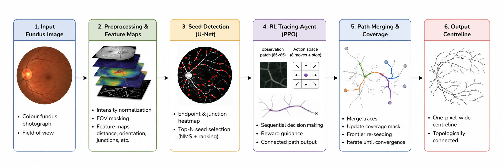

# Policy-Based Skeleton Tracing for Retinal Blood Vessels

This project trains an RL agent to trace blood vessel centerlines in retinal fundus images. The agent learns to navigate along blood vessel structures using a policy, trained via imitation learning followed by PPO fine-tuning. A seed detector predicts starting points, allowing for end-to-end inference without the need for ground-truth labels. The agent was compared against three baseline models: a Frangi vesselness filter, a greedy tracing heuristic, and a UNet CNN.

---

## Overview

### Pipeline at a glance



### Key ideas

- **Tracing-as-policy** — a PPO agent (CNN encoder, optional LSTM) outputs
  discrete world-frame steps; the trajectory is the skeleton.
- **21-channel egocentric observation** — local RGB crop, U-Net centerline
  prior, distance-transform/tangent geometry, visited/coverage maps, topology
  memory, and a multi-scale wide crop.
- **Directed-progress reward** — the primary per-step term rewards moving toward
  *uncovered* vessel; coverage, frontier-extension, off-vessel and revisit terms
  shape behaviour; a terminal F-β term credits the trace's contribution.
- **Frontier-based inference** — ring seeds + a frontier coverage strategy fan
  out across all branches; **snap-to-centerline** fixes sub-pixel drift and a
  **vessel-gate** drops off-vessel points (the single biggest quality lever,
  ≈ +0.39 F1).
- **No GT at inference** — every reported number is *certified leak-free* by a
  corrupt-GT byte-identity test.

---

## Repository Structure

```text
├── config.py                # Single source of truth for all hyperparameters (MODEL_CONFIG)
├── data/
│   ├── dataloader.py        # Combined multi-dataset loader; train/val split + held-out test
│   ├── centerline_ext.py    # GT centerline / skeleton extraction (cached)
│   └── fundus_prep.py       # FOV crop, resize-and-pad, normalisation
├── environment/
│   ├── vessel_env.py        # Gymnasium tracing environment (obs, step, termination)
│   ├── observation.py       # ObservationBuilder — the 21-channel egocentric stack
│   ├── reward.py            # Per-step + terminal reward terms
│   └── frontier_tracer.py   # Inference-time multi-seed frontier tracer (snap + gate)
├── models/
│   ├── policy_network.py    # ActorCriticNetwork (CNN encoder + policy/value heads)
│   ├── seed_detector.py     # Multi-task Attention U-Net
│   ├── frangi.py            # Frangi vesselness baseline
│   └── greedy_tracer.py     # Greedy steepest-ascent tracer baseline
├── training/
│   ├── imitation.py         # Behaviour-cloning warm start
│   ├── ppo.py               # PPO trainer (GAE, curriculum, entropy anneal)
│   └── curriculum.py        # Dynamic difficulty progression stages
├── scripts/                 # Execution entry points (see Usage)
└── evaluation/
    ├── metrics.py           # F1@τ, clDice, Betti-0, HD95 computations
    └── scoring.py           # Shared scorer so RL & baselines are metric-comparable
```

## Data

Training and validation use a balanced combination of five datasets. Testing uses two external datasets the models never see during training.

| role | datasets |
|---|---|
| **train / val** | FIVES, STARE, CHASEDB1, HRF, LES-AV |
| **test (held-out)** | DRIVE, DRHAGIS |

---

## Usage

All hyperparameters live in [`config.py`](config.py) (`MODEL_CONFIG`).

Run scripts as modules from the repo root with the venv active.

### 1. Train the seed detector

```bash
python -m scripts.train_seed_detector
```

### 2. Train the policy (imitation → PPO)

```bash
python -m scripts.train_imitation   # behaviour-cloning warm start
python -m scripts.train_ppo         # PPO, curriculum
```

### 3. Evaluate / test the traced skeletons

```bash
python -m scripts.run_rl_tracing --eval            # validation split
python -m scripts.run_rl_tracing --test            # held-out datasets
```

Outputs land in `results/<run>/RL_tracing_e2e/<split>/` (per-image
`metrics_e2e.csv`, a summary, and trajectory visualisations).

---

## Baselines

```bash
python -m scripts.run_frangi        --eval   # Frangi vesselness + centerline
python -m scripts.run_greedytracer  --eval   # greedy tracer
python -m scripts.run_cnn           --eval   # centerline U-Net
```

---

## Evaluation metrics

Results are saved as per-image CSVs and summary tables under `results/`:

- **F1@τ / precision / recall** at τ ∈ {1, 2, 3} px — centerline overlap at a tolerance band (headline = F1@2px).
- **clDice** — centerline-aware Dice.
- **Betti-0 error** — connected-component (topology) error, raw and post-processed.
- **gt_edge_cov80** — fraction of GT edges ≥ 80 % covered (recall of structure).
- **HD95** — 95th-percentile Hausdorff distance.

---

## Results

Final model:

| split | F1@2px | P@2 | R@2 | clDice | gt_edge_cov80 | Betti-0 | cert |
|---|---|---|---|---|---|---|---|
| **val** | **0.670** | 0.840 | 0.563 | 0.487 | 0.581 | 13.0 | PASS |
| **test — DRIVE** | **0.666** | 0.778 | 0.589 | 0.483 | 0.662 | 14.8 | PASS |
| **test — DRHAGIS** | **0.618** | 0.674 | 0.572 | 0.339 | 0.645 | 4.6 | PASS |


---

*This document was created with assistance from AI tools. The content has been reviewed and edited by the project authors.*
